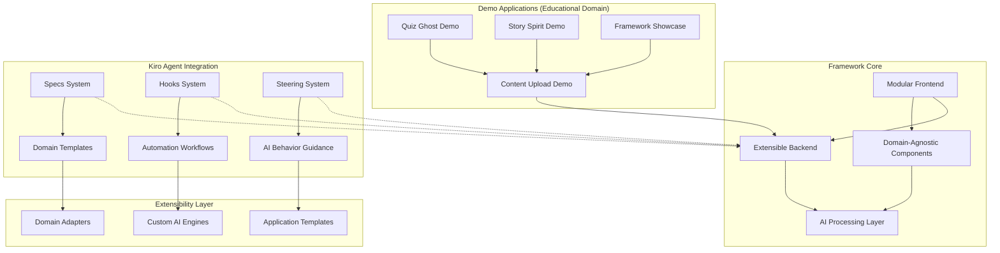

# GhostFrame Design Document

## Overview

GhostFrame is architected as a comprehensive modular AI framework layer that enables developers to register, build, and distribute Kiro-compatible AI modules across any domain. The framework provides a robust infrastructure including module registry, developer APIs, template generation, and deep Kiro integration capabilities.

The architecture features a three-tier system: Framework Core (infrastructure and APIs), Module Registry (discovery and management), and Kiro Integration Layer (specs, hooks, and steering). Quiz Ghost and Story Spirit serve as reference implementations, demonstrating best practices for module development while showcasing the framework's extensibility and cross-domain capabilities.

## Architecture

### High-Level Framework Architecture



### Technology Stack

**Frontend:**
- Next.js 14 with App Router
- React 18 with TypeScript
- TailwindCSS for styling
- Framer Motion for animations
- Lucide React for icons

**Backend:**
- Express.js with TypeScript
- Multer for file uploads
- CORS for cross-origin requests
- Morgan for logging

**Development:**
- ESLint and Prettier for code quality
- Husky for git hooks
- Deployment configs for Vercel and Render

## Components and Interfaces

### Frontend Components

#### Core Layout Components
```typescript
// components/Layout/AppLayout.tsx
interface AppLayoutProps {
  children: React.ReactNode;
  showNavigation?: boolean;
}

// components/Navigation/GhostNavigation.tsx
interface NavigationItem {
  href: string;
  label: string;
  icon: React.ComponentType;
  isActive?: boolean;
}
```

#### Feature Components
```typescript
// components/QuizGhost/QuizInterface.tsx
interface QuizInterfaceProps {
  questions: Question[];
  onComplete: (results: QuizResults) => void;
}

// components/StorySpirit/StoryViewer.tsx
interface StoryViewerProps {
  story: GeneratedStory;
  onRegenerate: () => void;
}

// components/FlashcardGenerator/FlashcardDeck.tsx
interface FlashcardDeckProps {
  cards: Flashcard[];
  onCardFlip: (cardId: string) => void;
}

// components/ContentUpload/UploadZone.tsx
interface UploadZoneProps {
  onFileUpload: (file: File) => Promise<void>;
  acceptedTypes: string[];
  maxSize: number;
}
```

#### Animation Components
```typescript
// components/Animations/GhostlyTransition.tsx
interface GhostlyTransitionProps {
  children: React.ReactNode;
  delay?: number;
  direction?: 'up' | 'down' | 'left' | 'right';
}

// components/Animations/SpookyLoader.tsx
interface SpookyLoaderProps {
  isLoading: boolean;
  message?: string;
}
```

### Backend API Interfaces

#### Route Handlers
```typescript
// routes/quiz.ts
interface GenerateQuizRequest {
  contentId: string;
  questionCount: number;
  difficulty: 'easy' | 'medium' | 'hard';
  questionTypes: ('multiple-choice' | 'true-false' | 'short-answer')[];
}

interface GenerateQuizResponse {
  quizId: string;
  questions: Question[];
  metadata: QuizMetadata;
}

// routes/story.ts
interface GenerateStoryRequest {
  contentId: string;
  theme: string;
  length: 'short' | 'medium' | 'long';
  targetAudience: 'children' | 'teens' | 'adults';
}

interface GenerateStoryResponse {
  storyId: string;
  title: string;
  content: string;
  keyPoints: string[];
}

// routes/flashcards.ts
interface GenerateFlashcardsRequest {
  contentId: string;
  cardCount: number;
  difficulty: 'beginner' | 'intermediate' | 'advanced';
}

interface GenerateFlashcardsResponse {
  deckId: string;
  cards: Flashcard[];
  metadata: DeckMetadata;
}

// routes/upload.ts
interface UploadContentRequest {
  file: Express.Multer.File;
  metadata?: ContentMetadata;
}

interface UploadContentResponse {
  contentId: string;
  processedText: string;
  keyTopics: string[];
  wordCount: number;
}
```

### Data Models

#### Core Data Types
```typescript
// types/content.ts
interface ProcessedContent {
  id: string;
  originalFilename: string;
  processedText: string;
  keyTopics: string[];
  wordCount: number;
  uploadedAt: Date;
  metadata: ContentMetadata;
}

interface ContentMetadata {
  title?: string;
  subject?: string;
  difficulty?: string;
  tags?: string[];
}

// types/quiz.ts
interface Question {
  id: string;
  type: 'multiple-choice' | 'true-false' | 'short-answer';
  question: string;
  options?: string[];
  correctAnswer: string;
  explanation: string;
  difficulty: number;
}

interface QuizResults {
  score: number;
  totalQuestions: number;
  answers: UserAnswer[];
  completedAt: Date;
}

// types/story.ts
interface GeneratedStory {
  id: string;
  title: string;
  content: string;
  keyPoints: string[];
  theme: string;
  targetAudience: string;
  generatedAt: Date;
}

// types/flashcard.ts
interface Flashcard {
  id: string;
  front: string;
  back: string;
  difficulty: number;
  topic: string;
  hints?: string[];
}
```

## Error Handling

### Frontend Error Handling
```typescript
// utils/errorHandling.ts
interface AppError {
  code: string;
  message: string;
  details?: any;
}

class ErrorBoundary extends React.Component {
  // Catches React component errors
  // Displays spooky error messages with ghost animations
}

// Custom hooks for API error handling
const useApiError = () => {
  // Handles API errors with toast notifications
  // Provides retry mechanisms for failed requests
}
```

### Backend Error Handling
```typescript
// middleware/errorHandler.ts
interface ApiError extends Error {
  statusCode: number;
  code: string;
  details?: any;
}

// Global error handler middleware
// Logs errors and returns consistent error responses
// Handles file upload errors, AI processing failures, etc.
```

### Error Categories
1. **Upload Errors**: File size limits, unsupported formats, processing failures
2. **AI Generation Errors**: API timeouts, content parsing failures, generation limits
3. **Validation Errors**: Invalid input parameters, missing required fields
4. **System Errors**: Database connections, external service failures

## Testing Strategy

### Frontend Testing
```typescript
// __tests__/components/QuizGhost.test.tsx
// Unit tests for React components using Jest and React Testing Library
// Integration tests for user workflows
// Visual regression tests for animations and theming

// __tests__/hooks/useQuizGeneration.test.tsx
// Custom hook testing for state management and API calls
```

### Backend Testing
```typescript
// __tests__/routes/quiz.test.ts
// API endpoint testing with supertest
// Mock AI service responses for consistent testing
// File upload testing with various file types and sizes

// __tests__/controllers/contentProcessor.test.ts
// Unit tests for content processing logic
// Edge case testing for malformed content
```

### Integration Testing
```typescript
// __tests__/integration/fullWorkflow.test.ts
// End-to-end testing of upload → process → generate workflow
// Cross-browser testing for frontend compatibility
// Performance testing for large file uploads
```

## Kiro Integration Points

### Specs Integration
```typescript
// .kiro/specs/
// Current spec files guide development
// Future specs can be auto-generated from user feedback
// Spec-driven feature development workflow
```

### Hooks Integration
```typescript
// .kiro/hooks/
// Auto-generate quizzes when new content is uploaded
// Trigger story generation based on user activity patterns
// Auto-update flashcards when content is modified
// Performance monitoring and optimization hooks
```

### Steering Integration
```typescript
// .kiro/steering/
// AI generation guidelines and best practices
// Content processing rules and filters
// User experience optimization rules
// Educational effectiveness guidelines
```

## Deployment Architecture

### Frontend Deployment (Vercel)
```typescript
// vercel.json configuration
// Environment variables for API endpoints
// Build optimization for Next.js
// CDN configuration for static assets
```

### Backend Deployment (Render)
```typescript
// render.yaml configuration
// Environment variables for AI services
// Health check endpoints
// Auto-scaling configuration
```

### Development Workflow
```typescript
// Local development with hot reload
// Docker containers for consistent environments
// CI/CD pipeline with automated testing
// Staging environment for integration testing
```

## Security Considerations

### File Upload Security
- File type validation and sanitization
- Size limits and rate limiting
- Virus scanning for uploaded files
- Secure file storage with access controls

### API Security
- CORS configuration for frontend domains
- Rate limiting for AI generation endpoints
- Input validation and sanitization
- Error message sanitization to prevent information leakage

### Data Privacy
- No persistent storage of uploaded content (Phase 1)
- Secure handling of temporary files
- Clear data retention policies
- User consent for AI processing

## Performance Optimization

### Frontend Performance
- Code splitting for feature modules
- Lazy loading for heavy components
- Image optimization for spooky assets
- Caching strategies for generated content

### Backend Performance
- Async processing for AI generation
- Request queuing for high load
- Caching for frequently requested content
- Connection pooling for external services

### Monitoring
- Performance metrics collection
- Error tracking and alerting
- User experience analytics
- AI generation success rates