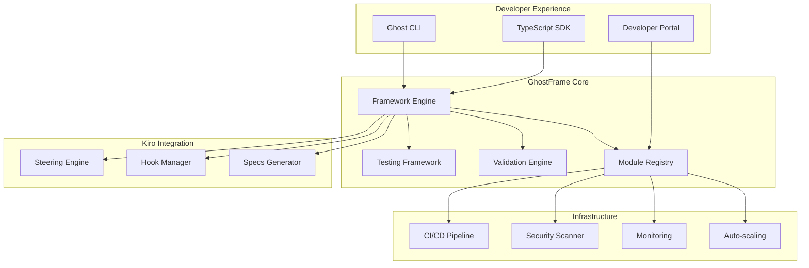

# 🎃 GhostFrame Developer Guide

Welcome to the comprehensive GhostFrame developer documentation! This guide will help you build, test, and deploy AI-powered modules using the GhostFrame production framework.

## 📚 Table of Contents

### Getting Started
- [Quick Start Guide](./quick-start.md)
- [Installation & Setup](./installation.md)
- [Your First Module](./first-module.md)
- [Framework Architecture](./architecture.md)

### Core Concepts
- [Module Development](./modules/README.md)
- [Kiro Integration](./kiro/README.md)
- [AI Model Integration](./ai-models/README.md)
- [Schema Design](./schemas/README.md)

### Development Tools
- [CLI Reference](./cli/README.md)
- [SDK Documentation](./sdk/README.md)
- [Testing Framework](./testing/README.md)
- [Validation System](./validation/README.md)

### Deployment & Operations
- [Deployment Guide](./deployment/README.md)
- [Environment Configuration](./environments/README.md)
- [Monitoring & Analytics](./monitoring/README.md)
- [Scaling & Performance](./scaling/README.md)

### Advanced Topics
- [Security Best Practices](./security/README.md)
- [Custom Integrations](./integrations/README.md)
- [Performance Optimization](./performance/README.md)
- [Troubleshooting](./troubleshooting/README.md)

### API Reference
- [REST API](./api/README.md)
- [SDK API](./sdk/api-reference.md)
- [CLI Commands](./cli/commands.md)
- [Configuration Reference](./configuration/README.md)

### Examples & Tutorials
- [Example Modules](./examples/README.md)
- [Step-by-Step Tutorials](./tutorials/README.md)
- [Best Practices](./best-practices/README.md)
- [Common Patterns](./patterns/README.md)

## 🚀 What is GhostFrame?

GhostFrame is a **production-ready modular AI framework** that enables developers to create, register, and deploy Kiro-compatible AI modules called "Ghosts". Think of it as "Next.js for AI applications" - providing the infrastructure, tools, and patterns you need to build scalable AI-powered applications.

### Key Features

- **🏗️ Modular Architecture**: Build reusable AI components that can be composed into larger applications
- **🤖 Kiro Integration**: Native support for Kiro specifications, hooks, and steering
- **⚡ Production Ready**: Built-in scaling, monitoring, security, and deployment capabilities
- **🛠️ Developer Tools**: Comprehensive CLI, SDK, and testing framework
- **📊 Analytics**: Real-time monitoring, performance metrics, and user analytics
- **🔒 Security**: Built-in security scanning, validation, and compliance features

### Framework Components



## 🎯 Who Should Use GhostFrame?

### AI Application Developers
Build production-ready AI applications with built-in best practices for scaling, monitoring, and security.

### Enterprise Teams
Deploy AI capabilities across your organization with centralized management, governance, and compliance.

### AI Researchers
Rapidly prototype and deploy AI models with automatic infrastructure provisioning and monitoring.

### Platform Engineers
Provide AI capabilities as a service to development teams with comprehensive tooling and observability.

## 🏃‍♂️ Quick Start

Get up and running with GhostFrame in under 5 minutes:

```bash
# Install the GhostFrame CLI
npm install -g @ghostframe/cli

# Initialize a new project
ghostframe init my-ai-project
cd my-ai-project

# Create your first module
ghostframe create --interactive

# Test your module
ghostframe test

# Deploy to development
ghostframe deploy --environment development
```

## 📖 Learning Path

### Beginner (New to GhostFrame)
1. [Quick Start Guide](./quick-start.md) - Get your first module running
2. [Framework Architecture](./architecture.md) - Understand the core concepts
3. [Your First Module](./first-module.md) - Build a complete module from scratch
4. [Testing Basics](./testing/basics.md) - Learn to test your modules

### Intermediate (Building Production Modules)
1. [Advanced Module Development](./modules/advanced.md) - Complex module patterns
2. [Kiro Integration Deep Dive](./kiro/advanced.md) - Leverage Kiro's full power
3. [Performance Optimization](./performance/README.md) - Make your modules fast
4. [Security Best Practices](./security/README.md) - Keep your modules secure

### Advanced (Framework Extension & Operations)
1. [Custom Integrations](./integrations/README.md) - Extend the framework
2. [Scaling & Infrastructure](./scaling/README.md) - Handle production loads
3. [Monitoring & Observability](./monitoring/README.md) - Monitor your modules
4. [Contributing to GhostFrame](./contributing/README.md) - Help improve the framework

## 🤝 Community & Support

### Getting Help
- **Documentation**: You're reading it! Check the relevant sections for detailed guides
- **GitHub Issues**: Report bugs and request features on our [GitHub repository](https://github.com/ghostframe/ghostframe)
- **Discord Community**: Join our [Discord server](https://discord.gg/ghostframe) for real-time help
- **Stack Overflow**: Tag your questions with `ghostframe` for community support

### Contributing
We welcome contributions! See our [Contributing Guide](./contributing/README.md) for details on:
- Reporting bugs and requesting features
- Contributing code and documentation
- Community guidelines and code of conduct

### Resources
- **Blog**: [blog.ghostframe.dev](https://blog.ghostframe.dev) - Latest updates and tutorials
- **Examples**: [github.com/ghostframe/examples](https://github.com/ghostframe/examples) - Real-world examples
- **Roadmap**: [github.com/ghostframe/ghostframe/roadmap](https://github.com/ghostframe/ghostframe/roadmap) - What's coming next

## 📄 License

GhostFrame is open source software licensed under the [MIT License](./LICENSE.md).

---

**Ready to build something amazing?** Start with our [Quick Start Guide](./quick-start.md) and join the future of AI application development! 🚀